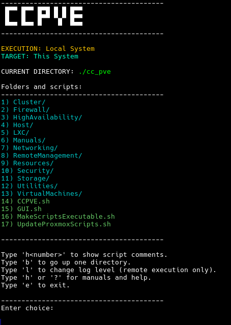

# Proxmox VE Management Scripts

[](https://github.com/coelacant1/ProxmoxScripts/actions/workflows/static.yml)[](https://github.com/coelacant1/ProxmoxScripts/actions/workflows/release.yml)

This repository is dedicated to providing automation scripts for managing Proxmox VE (Virtual Environment) systems efficiently. The scripts are designed for system administrators and DevOps professionals who need to streamline their Proxmox operations.

Explore the scripts for Proxmox VE management on the website:
[Visit the Proxmox VE One-Click Scripts Website](https://coelacant1.github.io/ProxmoxScripts/)

## Getting Started

These instructions will guide you on how to clone this repository and start using the scripts on your Proxmox server for development, testing, or production purposes.

### Prerequisites

Before using these scripts, ensure you have the following:
- Proxmox VE 8.x or newer installed and running, tested on PVE 8.x.
- SSH access to your Proxmox server with appropriate privileges.
- Knowledge of Proxmox operations and Linux shell command execution.
- You have read and understand what the scripts are doing on your system.

### Single Line Usage

Requires:
```bash
apt update
apt install wget unzip
```

To execute the single line call to navigate all scripts use:
```bash
bash -c "$(wget -qLO - https://github.com/coelacant1/ProxmoxScripts/raw/main/CCPVE.sh)"
```

Or an even shorter single line call:
```bash
bash <(curl -L pve.coela.sh)
```

Short single line call with the full header:
```bash
bash <(curl -L pve.coela.sh) -h
```

Use the testing branch (downloads from the 'testing' branch instead of 'main'):
```bash
bash <(curl -L pve.coela.sh) --testing
```

Or specify an explicit branch:
```bash
bash <(curl -L pve.coela.sh) --branch experimental-feature
```

### Direct Non-Interactive Script Execution

You can now execute a specific script from the repository directly (without launching the interactive text UI) using new flags exposed by `CCPVE.sh`.

List all runnable scripts (relative paths):
```bash
bash <(curl -L pve.coela.sh) --list
```

Run a specific script by relative path (as shown in the list):
```bash
bash <(curl -L pve.coela.sh) --run Host/QuickDiagnostic.sh
```

Pass arguments to that script:
```bash
bash <(curl -L pve.coela.sh) --run Storage/Benchmark.sh --args "--device /dev/nvme0n1 --mode quick"
```

Combined wget form examples:
```bash
bash -c "$(wget -qLO - https://github.com/coelacant1/ProxmoxScripts/raw/main/CCPVE.sh)" --list
bash -c "$(wget -qLO - https://github.com/coelacant1/ProxmoxScripts/raw/main/CCPVE.sh)" --run VirtualMachines/CreateFromISO.sh --args "--iso debian-12.iso --vmid 900 --storage local-lvm"
```

Notes:
- Arguments are passed verbatim to the target script (no additional quoting added).
- The repository is still downloaded fresh each invocation (ephemeral mode). For repeated usage, clone the repo instead.
- Use `--list` first if unsure of the correct relative path.
- Utilities path (`UTILITYPATH`) is exported automatically so scripts can source shared helpers.



### Installation

Requires git if you plan to download through cloning:
```bash
apt update
apt install git wget unzip
```

To execute these scripts offline on your system, follow these steps:

1. Clone the repository to your Proxmox server or your local machine and move the folder to your server:
    ```bash
    git clone https://github.com/coelacant1/ProxmoxScripts.git
    ```

2. Navigate into the cloned repository directory:
    ```bash
    cd ProxmoxScripts
    ```

3. Make the scripts executable:
    ```bash
    chmod +x MakeScriptsExecutable.sh
    ./MakeScriptsExecutable.sh
    ```

4. Execute a script by following the examples provided in comments within the scripts, adjusting parameters as needed for your environment. Or execute the text based GUI with:
    ```bash
    ./CCPVEOffline.sh
    ```

5. To update your repository automatically, call this:
    ```bash
    ./UpdateProxmoxScripts.sh
    ```


## Usage

For direct script calls, you may need to call the Utilities.sh script to initialize functions:
```bash
./Utilities.sh
./UpdateProxmoxScripts.sh
```

Example for description and example commands in each script in this repository:

- **Remote Migrate VMs** (`RemoteMigrateVMs.sh`):
  This script migrates virtual machines (VMs) from a local Proxmox node to a target Proxmox node.
  It utilizes the Proxmox API for migration and requires proper authentication using an API token.
  The script removes any existing Cloud-Init drives before initiating the migration and adjusts VM IDs based on a provided offset.

  Usage:
    ```bash
    ./RemoteMigrateVMs.sh <target_host> <api_token> <fingerprint> <target_storage> <vm_offset> <target_network>
    ```

  Where:
    target_host - The hostname or IP address of the target Proxmox server.
    api_token - The API token used for authentication.
    fingerprint - The SSL fingerprint of the target Proxmox server.
    target_storage - The storage identifier on the target node where VMs will be stored.
    vm_offset - An integer value to offset the VM IDs to avoid conflicts.
    target_network - The network bridge on the target server to connect the VMs.

## Contributing

If you would like to add to the ProxmoxScripts, please follow these steps:

- Fork the repository on GitHub.
- Commit your changes (git commit -m 'Add some YourFeature').
- Push to the branch (git push origin main).
- Submit a pull request through the GitHub website.

## Support

For support, please open an issue in the GitHub repository or contact the maintainers.
